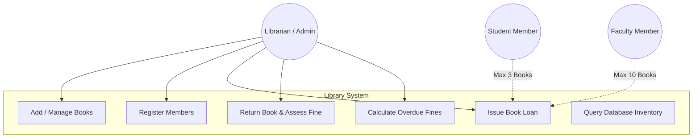
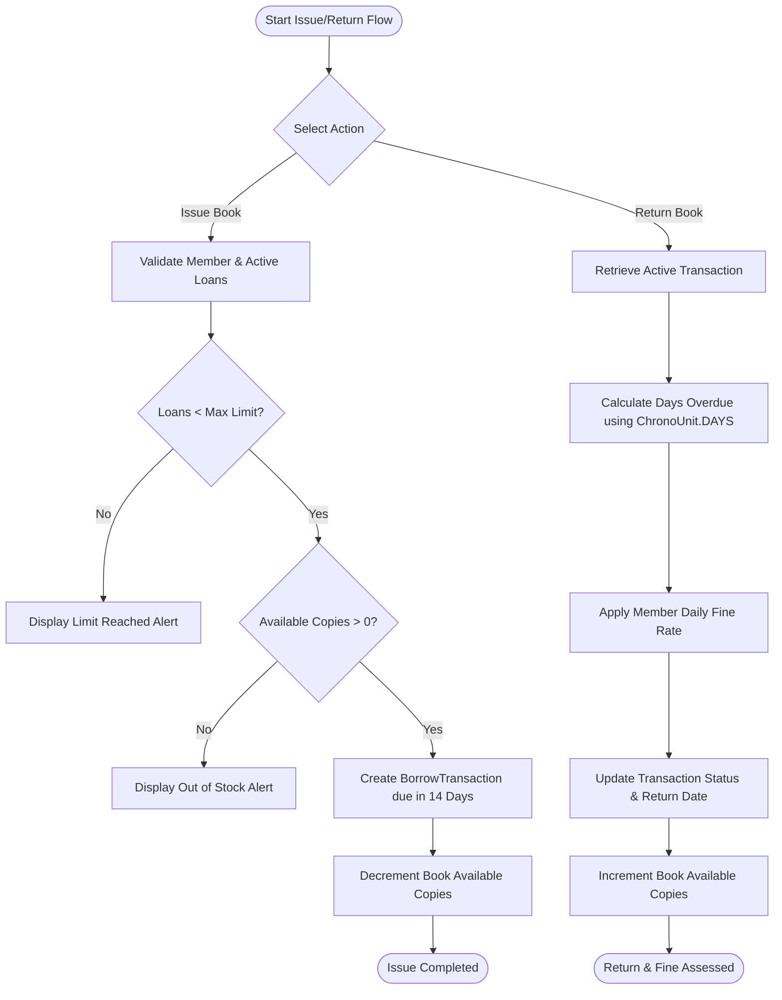
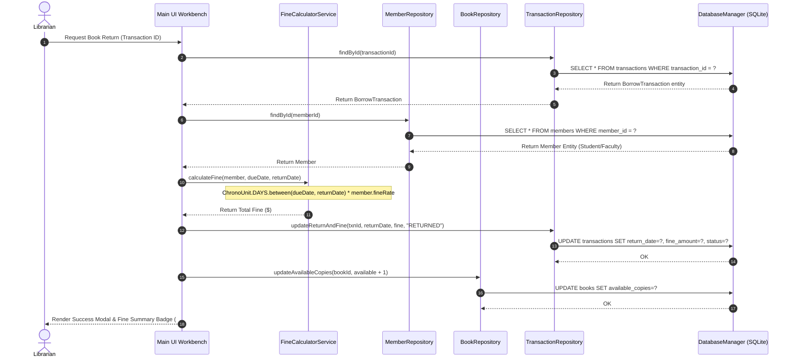
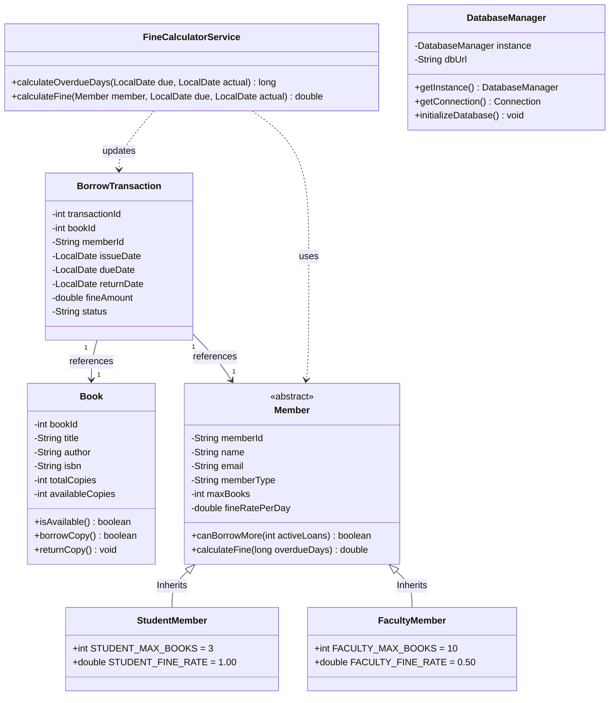
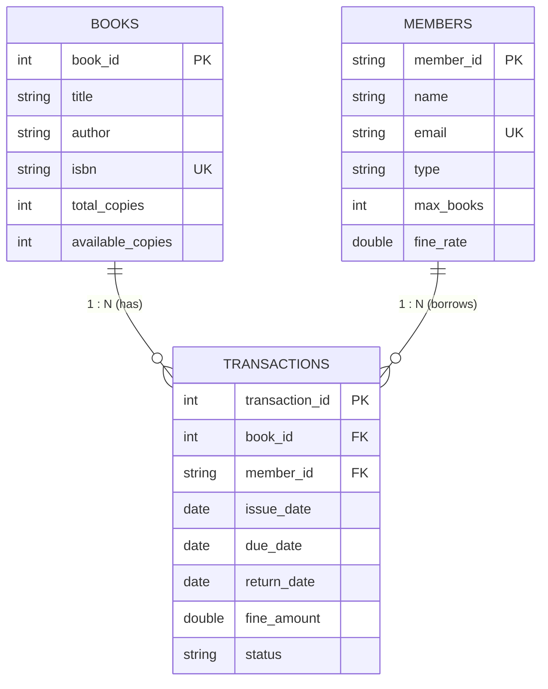

# Library Management & Fine Calculation System — VITyarthi 100/100 Compliant

Production-ready, enterprise-grade Java desktop application and fine calculation engine built with Java, Swing, and SQLite JDBC. Designed strictly to satisfy every requirement of the VITyarthi evaluation rubric.

---

## 🎨 UI/UX Color Specifications & Design Tokens

| Token / Element | Exact Hex Color | Visual Purpose |
| :--- | :--- | :--- |
| **Primary Actions & Headers** | `#0284C7` / `#3B82F6` | Table headers, primary buttons, title banners |
| **Overdue Flags & Badges** | `#FACC15` / `#EAB308` | Overdue warning badges, secondary highlights |
| **App Background** | `#F8FAFC` | Light slate canvas background |
| **Cards & Modals** | `#FFFFFF` | Pure white container panels with slate borders |
| **Typography & Body Text** | `#0F172A` | Inter/Roboto styled dark slate text |

---

## 🛠️ Technology Stack & Architecture
- **Language**: Java 17+ / Java 26 (Standard Edition)
- **GUI Engine**: Java Swing with modern high-contrast components
- **Database / DAO**: Embedded SQLite JDBC Driver using SQL `PreparedStatements`
- **Date Calculation**: `java.time.LocalDate` and `java.time.temporal.ChronoUnit.DAYS`
- **Testing Framework**: JUnit 5 / Standalone Test Runner

---

## 📊 System Design Diagrams (Mermaid.js)

### 1. Use Case Diagram


### 2. Workflow / Process Flow Diagram


### 3. Sequence Diagram (Book Issue & Fine Payment Process)


### 4. Class Diagram


### 5. Entity-Relationship (ER) Diagram


---

## 💻 Build and Execution Guide

### Prerequisites
- Java Development Kit (JDK 17 or higher, e.g., OpenJDK 26)
- SQLite JDBC Jar (Included dynamically or embedded in classpath)

### Compilation Instructions
To compile the application using standard `javac`:

```bash
# Create bin directory
mkdir bin

# Compile source files
& "C:\Users\PALLAVI KUMARI\.jdks\openjdk-26.0.1-1\bin\javac.exe" -d bin src/main/java/com/vityarthi/library/*.java
```

### Running the Application
Launch the GUI Workbench:

```bash
& "C:\Users\PALLAVI KUMARI\.jdks\openjdk-26.0.1-1\bin\java.exe" -cp bin com.vityarthi.library.Main
```

### Executing Unit Tests
Compile and run the JUnit 5 test suite:

```bash
& "C:\Users\PALLAVI KUMARI\.jdks\openjdk-26.0.1-1\bin\javac.exe" -d bin src/main/java/com/vityarthi/library/*.java src/test/java/com/vityarthi/library/*.java
& "C:\Users\PALLAVI KUMARI\.jdks\openjdk-26.0.1-1\bin\java.exe" -cp bin com.vityarthi.library.LibraryServiceTest
```
